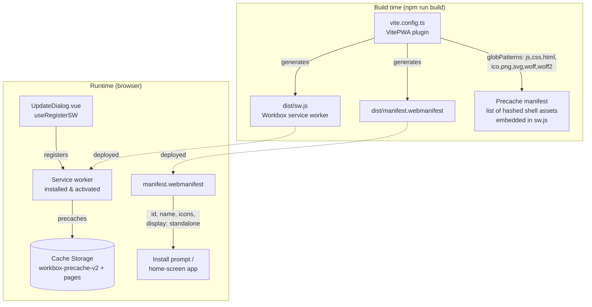
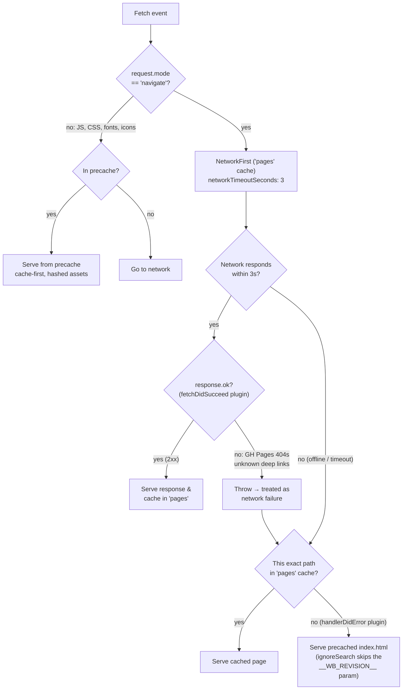
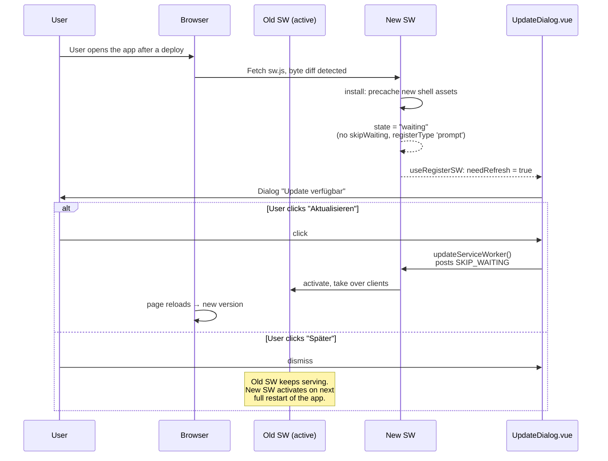
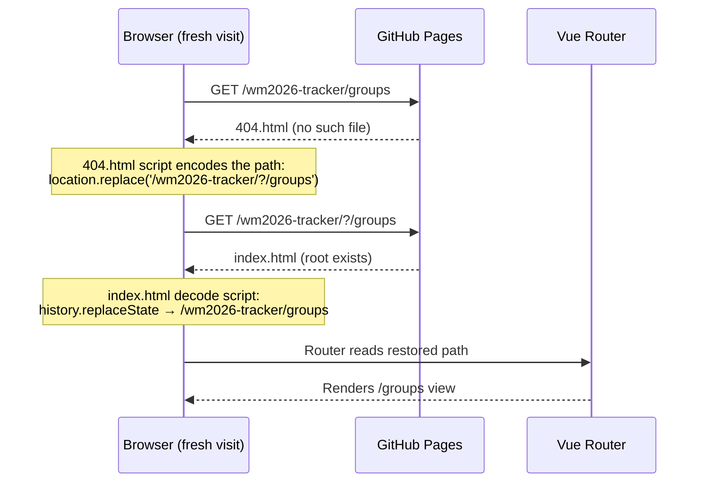
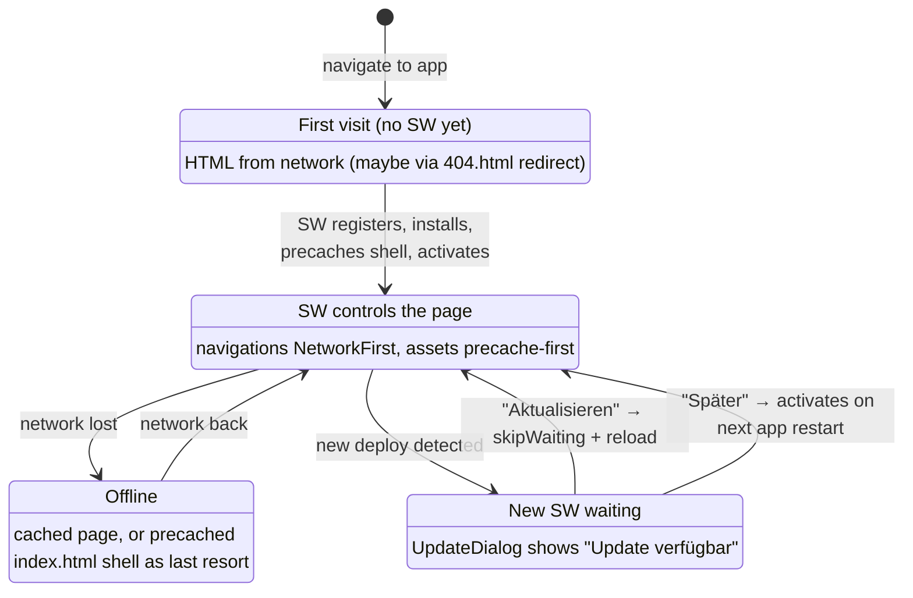

# PWA architecture

This document describes how several pieces fit together to make the app installable, offline-capable and updatable.
Those pieces are the `VitePWA` plugin in `vite.config.ts`, `index.html`, `public/404.html` and
`src/components/UpdateDialog.vue`.
It also covers the GitHub Pages quirks that several of the config options exist to work around.

## The moving parts

## Key decisions in `vite.config.ts`

| Option                 | Value                                   | Why                                                                                                                                                                                                 |
| ---------------------- | --------------------------------------- | --------------------------------------------------------------------------------------------------------------------------------------------------------------------------------------------------- |
| `registerType`         | `'prompt'`                              | A new SW installs and **waits** instead of activating on its own, so the user decides when to reload. See [Update flow](#update-flow).                                                              |
| `injectRegister`       | `false`                                 | Registration happens in `UpdateDialog.vue` via `useRegisterSW()` so the app can observe `needRefresh`. The plugin's auto-injected `registerSW.js` would register the SW a second time.              |
| `devOptions.enabled`   | `false`                                 | No SW in dev, which keeps the dev server and e2e tests deterministic.                                                                                                                               |
| `includeManifestIcons` | `false`                                 | The icons live in `public/icons/*.png` and already match `globPatterns`, so including them again would duplicate the precache entries.                                                              |
| `navigateFallback`     | `null`                                  | The plugin's default of `index.html` registers a precache-only route for navigations that would shadow the `NetworkFirst` runtime route below.                                                      |
| `directoryIndex`       | `null`                                  | Precaching's own route by default maps any URL ending in `/`, including the start URL, to precached `index.html` cache-first. That silently bypasses `NetworkFirst` for the most common navigation. |
| `base`                 | `DEPLOY_BASE_PATH` env var, default `/` | GH Pages serves from `/<repo>/` rather than the domain root.                                                                                                                                        |
| `manifest.id`          | `'.'`                                   | Resolved relative to the manifest URL, so the installed app's identity is the same locally (`/`) and on GH Pages (`/<repo>/`).                                                                      |

## How the service worker handles requests

Two cache layers work together.
The **precache** holds the app shell, is cache-first, and is populated at SW install.
The **`pages` runtime cache** holds navigations and is network-first.

Why navigations are `NetworkFirst` rather than served from the precached shell:

- **Online** users always get the freshest HTML the server has.
  GH Pages 404 responses are rejected by the `fetchDidSucceed` plugin instead of being cached or shown.
- **Offline** users get the page they visited before.
  As a last resort via `handlerDidError` they get the precached `index.html` shell, which the SPA router then resolves
  client-side.

The precached `index.html` exists _only_ for that last-resort fallback.
A brand-new page load is never controlled by its own not-yet-installed service worker.
So precaching at install time is the only way to have a shell ready before the second visit.

## Update flow

This combines `registerType: 'prompt'` with `useRegisterSW()` in `UpdateDialog.vue`:

Registering the SW inside a component, rather than letting the plugin inject `registerSW.js`, is what makes this
possible.
`useRegisterSW()` both performs the registration and exposes the reactive `needRefresh` flag that drives the dialog.

## GitHub Pages deep links (404.html redirect)

GH Pages is a static file host.
A fresh visit to `/wm2026-tracker/groups` has no server-side route and no service worker yet, so GH Pages serves
`404.html`.
The [spa-github-pages](https://github.com/rafgraph/spa-github-pages) trick smuggles the path through a query string:

This only matters **before** the service worker controls the page.
Once it does, the `NetworkFirst` navigation route intercepts deep links itself.
If GH Pages still answers 404, the `fetchDidSucceed` plugin converts that into a fallback to the cached shell.
See the request-handling diagram above.

## Lifecycle: first visit, offline, update

## Related files

- `vite.config.ts` holds all `VitePWA` configuration, which is this doc's main subject.
- `src/components/UpdateDialog.vue` does SW registration and the update prompt.
- `public/404.html` is the encode side of the GH Pages deep-link redirect.
- `index.html` holds the redirect decode script, plus the SW-independent boot-error safety net.
- `playwright.pwa.config.ts` and `e2e/pwa-offline.spec.ts` are the e2e tests that exercise the built SW.
